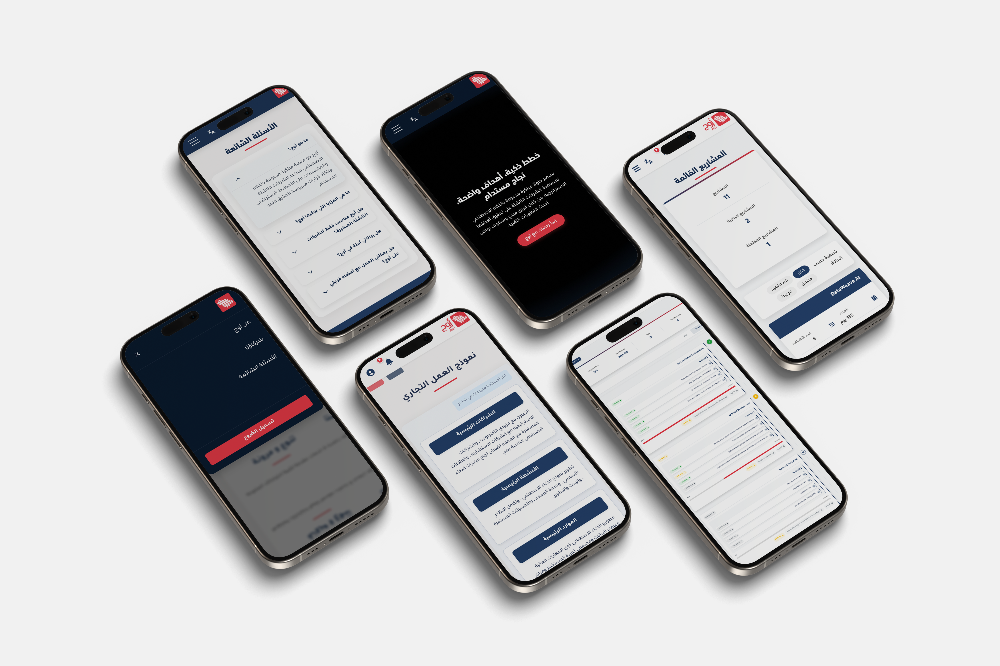
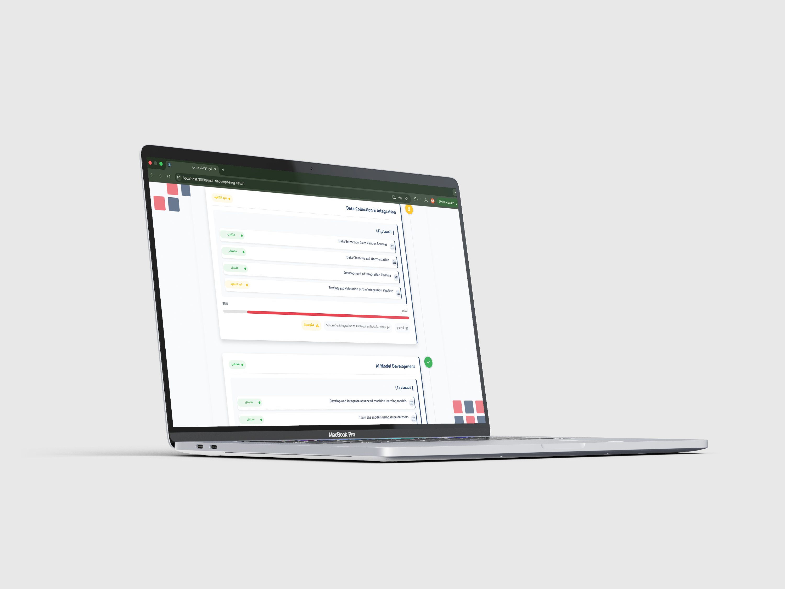
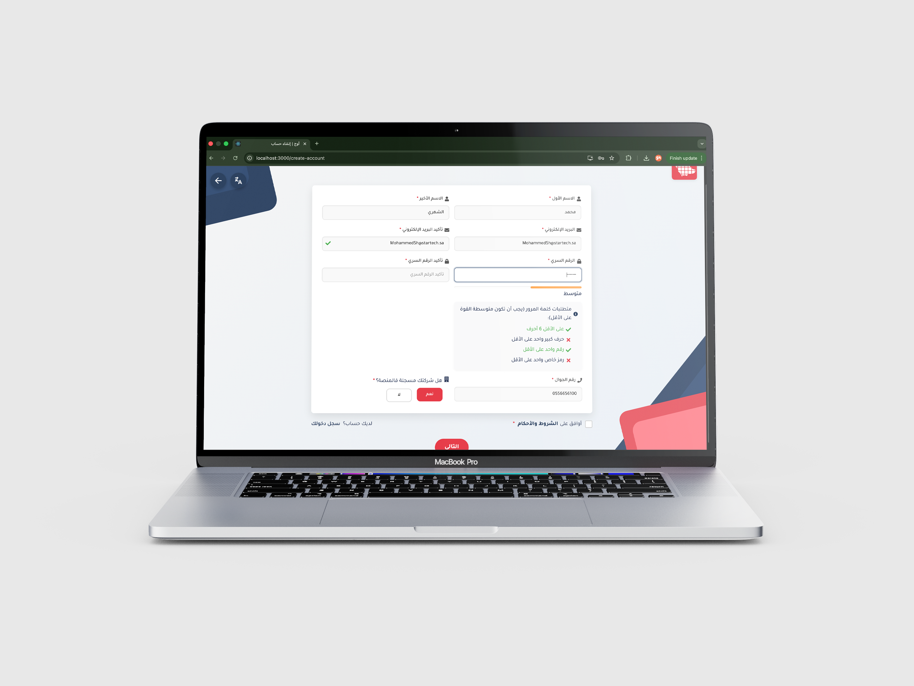
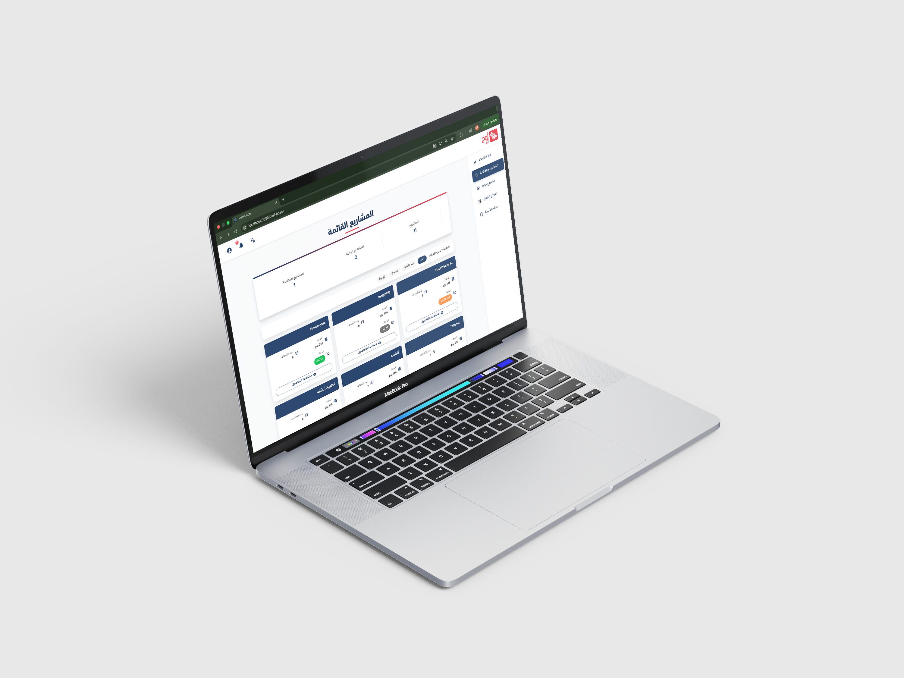

<div align="center">

# GenAI-Empowered Strategic Planning for Tech Startups 🚀

<p>
  
  &nbsp;
  
  &nbsp;
  
  &nbsp;
  
  &nbsp;
</p>

An AI-driven platform that empowers micro and small tech startups in Saudi Arabia with **personalized business model generation**, **structured goal decomposition**, and **performance tracking**, built to support Vision 2030's growing startup ecosystem.

[🌐 Landing page Live Demo](https://welcometoawj.vercel.app/)

</div>

---

<div align="center">
  
</div>

<p align="center">
  
  
  
</p>

---

## 📌 About The Project

Saudi Arabia's tech startup landscape is booming over **4,300** computer programming startups were registered in Q2 2024 alone. Yet most micro and small startups still struggle with:

- Building business models that fit their goals and resources
- Breaking high-level objectives into actionable steps
- Allocating resources and projecting realistic timelines

**AWJ** tackles all three through a single personalized GenAI-powered platform. Instead of static templates or expensive consultants, startups get tailored, data-driven strategic plans generated in seconds.

### ✨ Key Features

| Feature | Description |
|:--|:--|
| **Business Model Canvas Generator GenAI model** | Analyzes company profile to produce a complete, customized 9-component BMC |
| **Project Milestone Decomposer GenAI model** | Breaks goals into sequential milestones with tasks, timelines, KPIs, and risk assessments |
| **Interactive Dashboard** | Visualizes progress, tracks milestone completion, and surfaces performance insights |

---

## 🏆 Results & Validation

The platform was evaluated through AI model assessment, unit testing, and usability testing:

| Metric | Score |
|:--|:--|
| BMC Model Similarity | **0.7971** (6 of 11 components scored perfect 1.0) |
| Milestones Model Similarity | **0.6071** (Task generation scored highest at 0.7143) |
| Usability - Task Success Rate | **96%** |
| User Satisfaction | **5.0 / 5.0** |

> *"These GenAI models provide a solid foundation for micro and small tech startups and founders."*
> — Expert reviewer, **Monshaat** (Saudi SME Authority)

---

## 🛠️ Built With

<p align="center">
  
  
  
  
  
  
  
  
</p>

| Layer | Technology | Role |
|:--|:--|:--|
| **Frontend** | React.js, JavaScript, CSS | Dynamic UI, responsive design, user interaction |
| **Backend & Database** | Firebase Cloud Firestore | NoSQL storage, real-time sync, user/project data |
| **AI Engine** | Mistral via Ollama | Business model generation & milestone decomposition |
| **Visualization** | Power BI | Interactive dashboards with automated data refresh |
| **Data Augmentation** | Mistral, OpenAI o1 | Dataset generation, validation, and enrichment |

---

## 🏗️ Architecture

```
┌─────────────────────────────────────────────────┐
│               Frontend (React.js)               │
│         User inputs · Dashboard · BMC view      │
└──────────────────────┬──────────────────────────┘
                       │
              ┌────────▼────────┐
              │GenAI Model Layer│
              │ ┌─────────────┐ │
              │ │  BMC Model  │ │
              │ └─────────────┘ │
              │ ┌─────────────┐ │
              │ │  Milestones │ │
              │ │    Model    │ │
              │ └─────────────┘ │
              └────────┬────────┘
                       │
         ┌─────────────▼─────────────┐
         │ Firebase Cloud Firestore  │
         │ Users · Companies · Plans │
         └───────────────────────────┘
```

---

<div align="center">

&nbsp;

&nbsp;

&nbsp;

&nbsp;

&nbsp;

</div>
